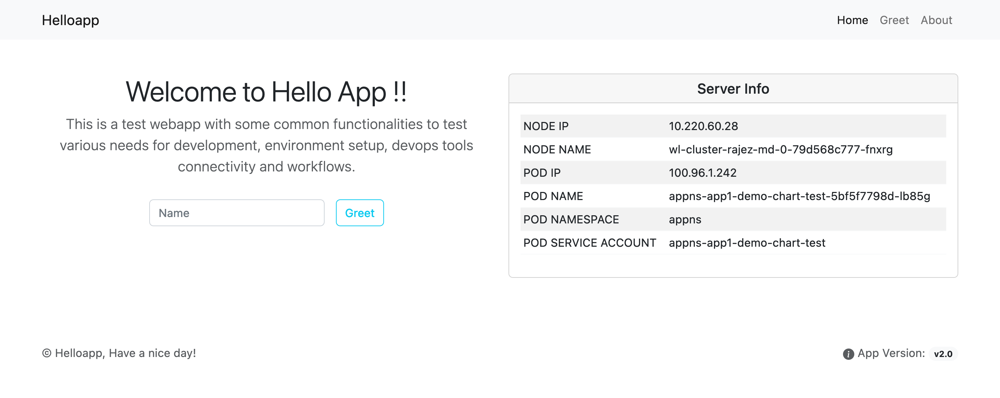

# helloapppython chart

## Introduction

This is a test api and webapp with some common functionalities to test various needs for development, environment setup and devops tools connectivity and workflows.

## Api's for the app

- Api to update the app version

  `http://localhost:5000/appver?val=<New-version>`

- Api to greet a user for the webapp

  `http://localhost:5000/greet/<name>`

  `http://localhost:5000/api/greet/<name>`

- Api for server info

  `http://localhost:5000/api/info`

## Functionalities

1. Update app version for the webapp ( by api)
2. Greet user with POST method ( via api and web)
3. Get server info, once deployed on Kubernetes (on homepage and via api in json format)

## TODOS

1. Add open api swagger

## Contact

You can reach me on [Twitter @rajinh24](https://twitter.com/rajinh24)

## License

